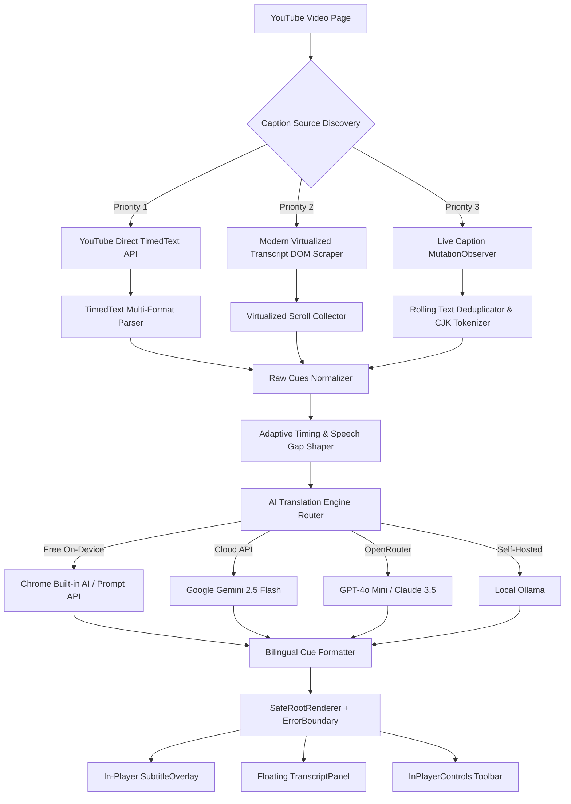

# YouTube AI Subtitle Translator ⚡

[](https://developer.chrome.com/docs/extensions/mv3/intro/)
[](https://react.dev/)
[](https://www.typescriptlang.org/)
[](https://tailwindcss.com/)
[](https://wxt.dev/)
[](https://vitest.dev/)

A high-performance Manifest V3 browser extension built with **[WXT](https://wxt.dev/)**, **React 19**, **TypeScript**, and **Tailwind CSS**.

It automatically extracts, cleans, and translates foreign-language YouTube video transcripts and live captions into natural, idiomatic subtitles using **Chrome Built-in AI (On-Device)**, **Google Gemini**, **OpenRouter**, or **Local Ollama**, rendered directly inside the YouTube video player with adaptive timing and synchronization.

---

## 🌟 Key Features

### 1. 🤖 Multi-Provider AI Translation Engine
- **Chrome Built-in AI (Free & On-Device)**: Runs locally on your machine using Chrome's built-in Gemini Nano / Prompt API with zero API keys or external server calls.
- **Google Gemini API**: Full support for `gemini-2.5-flash`, `gemini-2.0-flash`, and `gemini-2.5-pro` with automatic model fallback chains on rate limits.
- **OpenRouter**: Access hundreds of LLMs (GPT-4o mini, Claude 3.5 Sonnet, Llama 3) via standard OpenRouter API keys.
- **Local Ollama**: Self-hosted local translation models (e.g. `qwen2.5:0.5b`, `llama3.2`) with custom endpoint configuration.

### 2. 📜 Modern YouTube Virtualized DOM & TimedText Extraction
- **Modern Transcript Panel Scraping**: Automatically scans and virtualizes scrolling across YouTube's modern `transcript-segment-view-model` components to extract full transcripts when timedtext endpoints return empty responses.
- **Multi-Format TimedText Fallback**: Robust JSON3, SRV3 XML, and WebVTT parser supporting YouTube's auto-generated caption tracks.
- **Live Caption Observer**: Fallback `MutationObserver` with rolling phrase deduplication, CJK tokenizer, and smart sentence chunking for real-time live video streams.

### 3. ⏱️ Adaptive Reading Timing & Spoken Pace Shaper
- **Reading Duration Calculator**: Calculates optimal subtitle durations based on target language reading speeds (14–17 chars/sec for Western, 4–6 chars/sec for CJK).
- **Speech Gap Preservation**: Detects pauses and silences between sentences and respects natural gaps rather than stretching subtitles across pauses.
- **Duplicate Speech-to-Text Merge**: Merges repeated breath/sigh/laughter markers and identical consecutive cues.
- **Live Sync Offset Control**: Fine-tune subtitle sync with live `±ms` adjustment sliders directly in the popup.

### 4. 🎛️ In-Player Controls & Floating Searchable Transcript
- **In-Player Toolbar Button**: Seamless `[✨ AI Subs]`, `[📑 Transcript]`, and `[📥 Export]` buttons inserted right into YouTube's native bottom right controls.
- **Floating Transcript Panel**: Searchable side panel with real-time active cue highlighting, one-click time seeking, and export controls.
- **Bilingual Subtitle Layout**: Displays both translated text and original spoken language dialogue simultaneously with customizable scaling and opacity.

### 5. 🛡️ YouTube Kevlar SPA Lifecycle Hardening
- **`SafeRootRenderer` & `ErrorBoundary`**: Isolates React 19 root rendering from YouTube's polymer DOM recycling and traps exceptions locally.
- **Event Isolation**: Stops click/key bubbling to prevent conflicting with native YouTube player shortcuts or Kevlar event dispatchers (`_.I.dispatchEvent`).
- **`RunGuard` Abort Signals**: Cleanly cancels background translation batches and DOM scrapers on `yt-navigate-start`.

### 6. 📥 Comprehensive Subtitle Export
- Export clean **Translated SRT**, **Original SRT**, **Bilingual SRT**, or detailed **Diagnostics JSON** with covered duration and integrity validation.

---

## 🏗️ Architecture Overview



---

## 🚀 Installation

### Load Unpacked in Chrome / Brave / Edge

1. Clone or download the repository:
   ```bash
   git clone https://github.com/anilpdv/youtube-translator-ext.git
   cd youtube-translator-ext
   ```

2. Install dependencies and build the extension:
   ```bash
   npm install
   npm run build
   ```

3. Open your browser's Extensions page:
   - **Chrome / Brave:** `chrome://extensions`
   - **Edge:** `edge://extensions`

4. Enable **Developer mode** (toggle in the top-right corner).

5. Click **Load unpacked** and select the `.output/chrome-mv3` folder inside the project directory.

6. Open any foreign language YouTube video, click **AI Subs**, and enjoy translated subtitles!

---

## 🛠️ Development & Testing

```bash
# Start development server with Hot Module Reloading (HMR)
npm run dev

# Run Vitest unit & component test suite (136 tests)
npm test

# Run TypeScript type check
npm run compile

# Build production Manifest V3 bundle
npm run build

# Package extension as a deployable .zip
npm run zip
```

---

## ⚙️ Configuration & Settings

| Setting | Default | Description |
|---|---|---|
| `autoTranslate` | `true` | Automatically enable AI translation on video load |
| `provider` | `gemini` | `builtin` (Chrome AI), `gemini`, `openrouter`, `ollama`, or `youtube` |
| `geminiModel` | `gemini-2.5-flash` | Active Gemini model ID |
| `targetLanguage` | `English` | Target translation language |
| `subtitleBilingual` | `false` | Display both original and translated text simultaneously |
| `subtitlePosition` | `bottom` | `bottom` or `top` overlay placement |
| `subtitleFontSize` | `20` | Subtitle font size in pixels (14px – 36px) |
| `subtitleSyncOffsetMs` | `0` | Subtitle synchronization timing offset in milliseconds (±2000ms) |

---

## 📄 License

MIT © [anilpdv](https://github.com/anilpdv)
