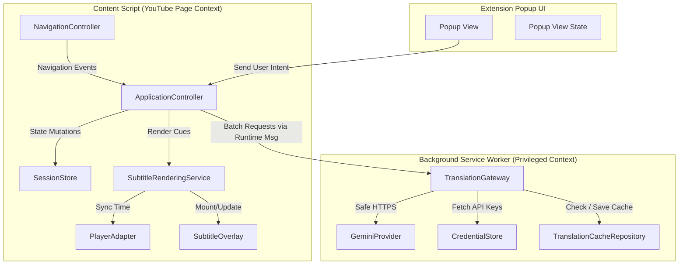

# YouTube Subtitle Translator

YouTube Subtitle Translator is a reliability-first browser extension that translates existing YouTube caption tracks into synchronized translated or bilingual subtitles.

The stable workflow supports explicit caption-track selection, manual translation start, secure provider communication, cancellation, partial recovery, local resume, subtitle display controls, and translated SRT export.

---

## 1. Product Purpose

YouTube Subtitle Translator provides high-reliability, synchronized subtitle translation for YouTube watch pages. It focuses on deterministic caption-track extraction, explicit provider execution, isolated background credential management, and robust error recovery, ensuring translation does not break or drift across video playback, seeking, or YouTube SPA navigation.

---

## 2. Stable V1 Capabilities

The Stable V1 release provides a fully supported, reliable subtitle translation pipeline:

- **Standard YouTube Watch Pages**: Seamless integration with standard desktop YouTube video watch pages (`/watch?v=...`).
- **Existing YouTube Caption Tracks**: Discovers and extracts official and community caption tracks.
- **Manual and Auto-Generated Captions**: Robust parsing and normalization of standard timedtext caption formats (JSON3 and WebVTT).
- **Manual Target-Language Selection**: Explicit selection of the desired subtitle language from verified BCP-47 language targets.
- **Explicit Provider & Model Selection**: Direct selection of translation provider (e.g. Google Gemini API) and specific model.
- **Manual Translation Start**: User-initiated translation lifecycle from the popup interface.
- **Progress Tracking & Cancellation**: Real-time batch progress tracking with responsive cancellation via `AbortSignal`.
- **Validated Cue-to-Translation Mapping**: Strict 1:1 validation between source cue IDs and translated cue responses, preventing cue drops and translation drift.
- **Partial Completion & Failed-Section Retry**: Unfinished or failed batches are tracked, allowing resumption without restarting completed batches.
- **Display Modes**: Toggle between Original, Translated, and synchronized Bilingual subtitle views with custom styling (colors, font size, background opacity).
- **Local Translation Cache & Resume**: Local IndexedDB cache keyed by video ID, caption track, prompt version, batch configuration, and source content hash for instant resume.
- **Translated SRT Export**: Standard-compliant, validated SubRip (.srt) export of translated subtitles.
- **Privacy-Safe Diagnostics**: Bounded error telemetry and diagnostic export with strict allowlists and automated secret redaction.

---

## 3. Not Supported in Stable V1

The following scenarios are explicitly out of scope for the Stable V1 reliability promise:

- Videos without captions
- Audio transcription (speech-to-text from audio streams)
- Livestream translation
- YouTube Shorts (`/shorts/...`)
- Embedded players (third-party `iframe` embeds)
- Automatic translation without user confirmation
- Automatic provider fallback (e.g. silently switching from Gemini to third-party endpoints)
- Automatic model fallback

---

## 4. Experimental Features

The following features are disabled by default in Stable V1 builds and are not covered by the Stable V1 reliability guarantee:

- **Transcript-panel DOM extraction**: Fallback scraping of YouTube's interactive transcript sidebar.
- **Live-caption observation**: MutationObserver-based real-time capture from live player captions.
- **Adaptive subtitle timing**: Dynamic reading-speed pacing and heuristic gap expansion.
- **On-device browser translation**: Experimental Chrome Built-in AI (`window.ai` / Prompt API).
- **Local Ollama**: Self-hosted local Ollama server integration.
- **Additional cloud providers**: OpenRouter and custom OpenAI-compatible endpoint bridges.
- **Floating transcript panel**: Dedicated floating transcript sidebar overlay.
- **In-player toolbar controls**: Injected custom buttons inside the native YouTube player control bar.

---

## 5. Architecture

The extension is structured into decoupled, single-responsibility domains designed for state safety and resource isolation:


```mermaid
flowchart TD
    subgraph ContentScript ["Content Script (YouTube Page Context)"]
        AC[ApplicationController]
        SS[SessionStore]
        NC[NavigationController]
        SRS[SubtitleRenderingService]
        PA[PlayerAdapter]
        SO[SubtitleOverlay]
    end

    subgraph BackgroundWorker ["Background Service Worker (Privileged Context)"]
        TG[TranslationGateway]
        GP[GeminiProvider]
        CS[CredentialStore]
        TCR[TranslationCacheRepository]
    end

    subgraph ExtensionPopup ["Extension Popup UI"]
        PV[Popup View]
        PVS[Popup View State]
    end

    NC -->|Navigation Events| AC
    AC -->|State Mutations| SS
    AC -->|Render Cues| SRS
    SRS -->|Sync Time| PA
    SRS -->|Mount/Update| SO

    PV -->|Send User Intent| AC
    AC -->|Batch Requests via Runtime Msg| TG
    TG -->|Fetch API Keys| CS
    TG -->|Check / Save Cache| TCR
    TG -->|Safe HTTPS| GP
```

- **`app/`**: Core application lifecycle controller (`ApplicationController`), authoritative state store (`SessionStore`), and cancellation-aware session management (`TranslationSession`).
- **`captions/`**: Caption track discovery, timedtext fetchers, format parsers (JSON3, WebVTT), and cue normalization pipelines.
- **`translation/`**: Bounded batching, translation prompt builder, provider contracts, and response validators ensuring strict ID matching.
- **`rendering/`**: Subtitle scheduling, DOM player adapters, cue time indexers, and isolated React overlay rendering.
- **`cache/`**: IndexedDB-backed cache repository with multi-attribute cache keys and deterministic content hashing.
- **`security/`**: Background-only credential storage, allowlisted network request policies, message validators, and secret redactors.
- **`observability/`**: Bounded in-memory metrics, structured logger, and privacy-sanitized diagnostic bundles.
- **`release/`**: Build channel configurations (Stable, Beta, Development), feature flag gates, and migration runners.

---

## 6. Data Flow and Privacy

- **Local Caption Processing**: Caption discovery, timedtext parsing, and cue synchronization run strictly within the local browser environment.
- **Explicit Translation Requests**: Caption text is only transmitted to translation endpoints when the user explicitly triggers translation.
- **Background Credential Isolation**: API keys and tokens are stored securely in the extension's background storage and accessed only by background workers. Content scripts running on `youtube.com` never receive or store API credentials.
- **No Audio Transmission**: Audio streams and user telemetry are never recorded, captured, or uploaded.
- **Sanitized Diagnostics**: Exported diagnostics and error logs automatically strip API keys, authorization headers, video identifiers, and sensitive parameters.
- **Local Data Deletion**: Users can purge all cached translations, saved settings, and credentials at any time through the extension settings.

---

## 7. Installation

### From Chrome Web Store (Recommended)
Install the official release from the [Chrome Web Store](https://chrome.google.com/webstore) (link coming upon general release).

### Manual Installation (Developer / Beta)
1. Download or clone the repository:
   ```bash
   git clone https://github.com/anilpdv/youtube-translator-ext.git
   cd youtube-translator-ext
   ```
2. Install dependencies:
   ```bash
   npm ci
   ```
3. Build the extension for your target channel:
   ```bash
   npm run build:stable
   # Or for beta channel:
   npm run build:beta
   ```
4. Open your browser and navigate to `chrome://extensions`.
5. Enable **Developer mode** in the top-right corner.
6. Click **Load unpacked** and select the `.output/chrome-mv3` folder.

---

## 8. Provider Configuration

### Google Gemini API (Recommended for Stable V1)
1. Obtain an API key from Google AI Studio ([https://aistudio.google.com/](https://aistudio.google.com/)).
2. Open the extension popup on any YouTube video page.
3. In the Settings tab, select **Google Gemini** as your provider.
4. Enter your API Key and choose a supported model (`gemini-2.5-flash` or `gemini-2.0-flash`).
5. Click **Save Settings**. The key is validated and securely stored in the background worker context.

---

## 9. Development

### Prerequisites
- Node.js >= 20.x
- npm >= 10.x

### Workflow Commands
```bash
# Start development mode with hot reload
npm run dev

# Type check TypeScript files without emitting code
npm run compile

# Run linter and formatting checks
npm run test:validate

# Build for development channel
npm run build:development
```

---

## 10. Testing

The repository enforces strict testing across unit, contract, integration, race, and security suites:

```bash
# Run all unit and domain test suites
npm run test:unit

# Run interface contract verification tests
npm run test:contracts

# Run integration tests
npm run test:integration

# Run race condition and lifecycle tests (e.g. navigation during translation)
npm run test:race

# Run Playwright E2E browser tests
npm run test:e2e

# Run complete test verification pipeline
npm test
```

---

## 11. Release Channels

- **Stable**: Fully verified releases with all experimental features strictly disabled and locked to verified caption endpoints and providers.
- **Beta**: Feature-preview channel with release candidate builds for early testing and migration verification.
- **Development**: Local development environment with debugging fixtures, mock providers, and configurable feature flags.

To package artifacts for release:
```bash
npm run package:beta
npm run package:stable
npm run verify:release
```

---

## 12. Troubleshooting

| Issue | Cause | Solution |
| :--- | :--- | :--- |
| **"No captions available for this video"** | The video does not provide native or auto-generated subtitle tracks. | Stable V1 requires existing captions. Speech-to-text audio transcription is unsupported. |
| **"API Key Invalid or Missing"** | The configured Gemini API key is missing or rejected by the provider. | Verify the API key in the extension popup settings and confirm quota in Google AI Studio. |
| **"Translation Paused / Network Error"** | Temporary network interruption or provider rate limit. | Click "Retry Failed" in the popup to re-request incomplete batches without losing progress. |
| **Subtitles out of sync after seeking** | Video seeked past untranslated cue range. | Allow current batch translation to complete or seek within translated time ranges. |

For detailed operational guidance, see [docs/TROUBLESHOOTING.md](docs/TROUBLESHOOTING.md).

---

## 13. Security Reporting

Please report suspected vulnerabilities privately to the maintainers rather than opening public GitHub issues.

See [docs/SECURITY.md](docs/SECURITY.md) for vulnerability disclosure procedures, PGP keys, and security guarantees.

---

## 14. Roadmap

- **Phase 11 (Upcoming)**: Multi-provider stable admission (Ollama & OpenRouter qualifications).
- **Phase 12**: Advanced subtitle styling controls (custom font selection, backdrop blur, custom CSS positioning).
- **Phase 13**: Additional export formats (Bilingual SRT, WebVTT, Plaintext transcript).
- **Phase 14**: On-device Chrome Prompt API / Built-in AI qualification for Stable.
